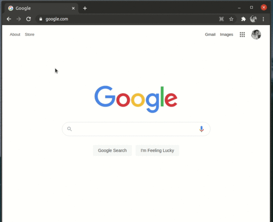

# Chrome light tab suspender

An alternative Chrome extension to [the great suspender](https://github.com/greatsuspender/thegreatsuspender).

**Pros:**  

- Maintain user privacy
- Light implementation

**Demo:**  

### Install extension from source

1. Download the [latest version](https://github.com/shaunmolloy/chrome-light-tab-suspender/releases) and extract. It'll be a good idea to keep this in your home directory, where it may not be accidentally deleted.  
2. In Google Chrome, navigate to [chrome://extensions/](chrome://extensions/) and enable "Developer mode" in the upper right corner.  
3. Click the "Load unpacked extension" button.
4. Browse to the src directory from the extracted folder and confirm.
